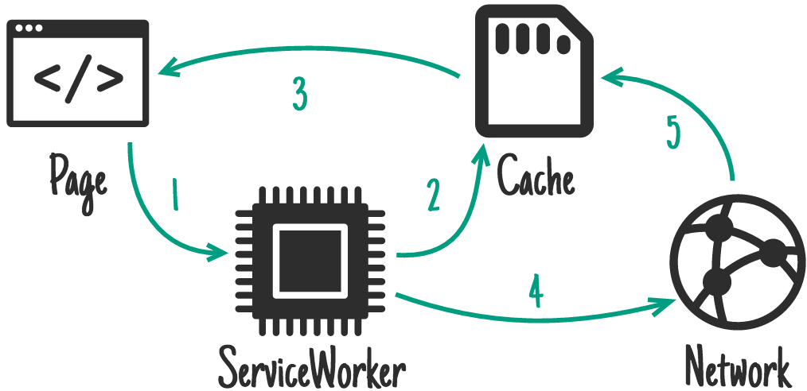

# Assets Cache

## Install

**NPM**

```shell
npm i @glacierjs/plugin-assets-cache --save
```

**CDN**

```javascript
// in service-worker.js
importScripts("//cdn.jsdelivr.net/npm/@glacierjs/core/dist/index.min.js");
importScripts('//cdn.jsdelivr.net/npm/@glacierjs/sw/dist/index.min.js');
importScripts('//cdn.jsdelivr.net/npm/@glacierjs/plugin-assets-cache/dist/index.min.js');

const { GlacierSW } = self['@glacierjs/sw'];
const { AssetsCacheSW, Strategy } = self['@glacierjs/plugin-assets-cache'];
```

## Usage

```javascript
// in service-worker.js
import { GlacierSW } from '@glacierjs/sw';
import { AssetsCacheSW, Strategy } from '@glacierjs/plugin-assets-cache';

const glacierSW = new GlacierSW();

glacierSW.use(new AssetsCacheSW({
    routes: [{
        // capture as string: store index.html with stale-while-revalidate strategy.
        capture: 'https://mysite.com/index.html',
        strategy: Strategy.STALE_WHILE_REVALIDATE,
    }, {
        // capture as RegExp: store all images with cache-first strategy
        capture: /\.(png|jpg)$/,
        strategy: Strategy.CACHE_FIRST
    }, {
        // capture as function: store all stylesheet with cache-first strategy
        capture: ({ request }) => request.destination === 'style',
        strategy: Strategy.CACHE_FIRST
    }],
}));
```
## Multiple Caching Strategies

### stale-while-revalidate

The **stale-while-revalidate** mode allows you to use the cache (if available) to respond to requests as soon as possible, and fallback to network requests if there is no cache.    
Then use the network request to update the cache.



```javascript
glacierSW.use(new AssetsCacheSW({
    routes: [{
        capture: xxx,
        strategy: Strategy.STALE_WHILE_REVALIDATE,
    }],
}));
```

### cache-first

Offline web applications will rely heavily on caching, but for non-critical resources that can be cached gradually, **"cache-first"** is the best option.   
If there is a response in the cache, the cached response will be used to satisfy the request and the network will not be used at all.    
If the response is not cached, the request will be fulfilled by a network request, and then the response will be cached so that the next request will be served directly from the cache next time.


```javascript
glacierSW.use(new AssetsCacheSW({
    routes: [{
        capture: xxx,
        strategy: Strategy.CACHE_FIRST,
    }],
}));
```

### network-first


For frequently updated requests, the **"network first"** strategy is the ideal solution.    
By default it will try to get the latest response from the network.    
If the request is successful, it will put the response into the cache.    
If the network fails to return a response, the cached response will be used.


```javascript
glacierSW.use(new AssetsCacheSW({
    routes: [{
        capture: xxx,
        strategy: Strategy.NETWORK_FIRST,
    }],
}));
```


### network-only

If you need to fulfill a specific request from the network, **network-only** mode will transparently transmit the resource request to the network.


```javascript
glacierSW.use(new AssetsCacheSW({
    routes: [{
        capture: xxx,
        strategy: Strategy.NETWORK_ONLY,
    }],
}));
```
### cache-only

The **cache-only** strategy ensures that responses are fetched from the cache.     
This scenario is less common, and it is generally useful to match the "pre-cache" strategy.


```javascript
glacierSW.use(new AssetsCacheSW({
    routes: [{
        capture: xxx,
        strategy: Strategy.CACHE_ONLY,
    }],
}));
```

## API

### registerRoute(route)

Dynamically register routes

```javascript
import { GlacierSW } from '@glacierjs/sw';
import { AssetsCacheSW, Strategy } from '@glacierjs/plugin-assets-cache';

const glacierSW = new GlacierSW();

const assetsCachePlugin = new AssetsCacheSW();

glacierSW.use(assetsCachePlugin);

// you can register route after plugin used.
assetsCachePlugin.registerRoute({
    capture: /\.(png|jpg)$/,
    strategy: Strategy.CACHE_FIRST
});
```

### updateRoute(routes)

Refresh routes, it will first clean up the current route, and then register the new route.    
This interface is especially suitable for scenarios where routing is controlled by external configuration.

```javascript
import { GlacierSW } from '@glacierjs/sw';
import { AssetsCacheSW, Strategy } from '@glacierjs/plugin-assets-cache';

const glacierSW = new GlacierSW();
const assetsCachePlugin = new AssetsCacheSW();

glacierSW.use(assetsCachePlugin);

assetsCachePlugin.registerRoute({
    capture: /\.(png|jpg)$/,
    strategy: Strategy.CACHE_FIRST
});

// will clean above route, and then register new routes.
assetsCachePlugin.updateRoute([{
    capture: 'https://mysite.com/index.html',
    strategy: Strategy.STALE_WHILE_REVALIDATE,
}, {
    capture: /\.(png|jpg)$/,
    strategy: Strategy.CACHE_FIRST
}, {
    capture: ({ request }) => request.destination === 'style',
    strategy: Strategy.CACHE_FIRST
}])
```


> More API reference [api/modules/plugin_assets_cache](https://jerryc8080.github.io/GlacierJS/api/modules/plugin_assets_cache_src.html)

> This plugin is backed by [workbox-routing](https://developers.google.com/web/tools/workbox/modules/workbox-routing) and [workbox-strategy](https://developers.google.com/web/tools/workbox/modules/workbox-strategies#stale-while-revalidate)