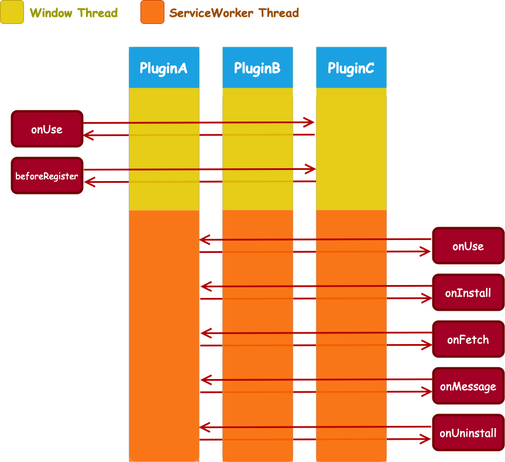

# Multidimensional Onion Plugin System

## Overview

GlacierJS encapsulates traditional ServiceWorker lifecycle hooks to support plug-in.
The plug-in system implements an "onion" for each native lifecycle hook according to the onion model, so we call this system:

> **Multidimensional Onion Plugin System**



Based on the onion model, we can make things more focused, for example, we want to log a resource request:

```javascript
class Log implements ServiceWorkerPlugin {

    // listen fetch event for all request
    public async onFetch(context: FetchContext, next) {
        const resourceUrl = context.res?.url;

        console.log(`Request a resource: ${resourceUrl}`)';
        try {
            // hand over the control to plugins behind.
            await next();
            // while behind plugins calling was all succeed.
            console.log(`request success: ${resourceUrl}`);
        } catch (err) {
            // while behind plugins calling has failed.
            console.error(`request failE: ${resourceUrl}`);
        }
    }
}
```

After encapsulating the traditional life cycle, we provide a more elegant life cycle hook function for each plugin.


## The Lifecycle

### Main Thread

```javascript
// code in window thread
import { WindowPlugin } from '@glacierjs/window';
import type { UseContext } from '@glacierjs/window';

export class MyPluginWindow implements WindowPlugin {
    constructor() {...}
    public onUse(context: UseContext) {...}
    public async beforeRegister() {...}
}
```

#### onUse: (context: UseContext) => void

* `context` [\<UseContext\>](https://jerryc8080.github.io/GlacierJS/api/modules/window_src.html#UseContext) current context, you can get the current instance of glacier.

This hook is fired when the plugin is used:
```javascript
glacierWindow.use(new MyPlugin());
```

If your plugin needs to use a `workbox instance` or a `glacier instance` in subsequent runs,
They can be left in the current plugin scope at this stage:
```javascript
public onUse(context: UseContext) {
    const { glacier, workbox } = context;
    this.glacier = glacier;
    this.workbox = workbox;
}
```

#### beforeRegister: (context: Object, next?: NextFn) => Promise\<void\>

* `context`  An empty object that components can use as a means of communication.
* `next` [\<HookFn\>](https://jerryc8080.github.io/GlacierJS/api/modules/core_src.html#NextFn) Returns a Promise to monitor the completion or failure of the following plugin.

This hook is triggered when the main thread is about to be registered.
At this stage you can do some asynchronous operations, for example we use remote configuration to decide whether to uninstall the ServiceWorker:
```javascript
public async beforeRegister(): Promise<void> {
    const config = await fetchRemoteConfig();

    // uninstall service worker while switch off
    if (config.switch === false) {
        // tell service worker thread to do some cleans job , and then uninstall it.
        this.glacier.unregister();

        // cut off behind plugins calling.
        throw ner Error('switch off service worker');
    }
}
```

### ServiceWorker Thread

```javascript
// code in service worker thread
import { ServiceWorkerPlugin } from '@glacierjs/sw';
import type { FetchContext, UseContext  } from '@glacierjs/sw';

export class MyPluginSW implements ServiceWorkerPlugin {
    constructor() {...}
    public async onUse(context: UseContext) {...}
    public async onInstall(context: InstallContext) {...}
    public async onActivate(context: ActivateContext) {...}
    public async onFetch(context: FetchContext) {...}
    public async onMessage(context: MessageContext) {...}
    public async onUninstall() {...}
}
```

#### onUse: (context: UseContext) => void

* `context` [\<UseContext\>](https://jerryc8080.github.io/GlacierJS/api/interfaces/sw_src.UseContext.html) The current context, you can get the current `glacier instance`

This hook is fired when the plugin is used:
```javascript
glacierSW.use(new MyPlugin());
```

Its purpose is similar to the main thread `onUse`.

#### onInstall: (context: InstallContext, next?: NextFn) => Promise<void>

* `context` [\<InstallContext\>](https://jerryc8080.github.io/GlacierJS/api/interfaces/sw_src.InstallContext.html):
    * `event` [\<ExtendableEvent\>](https://developer.mozilla.org/en-US/docs/Web/API/ExtendableEvent) Instance for the traditional [`install event`](https://developer.mozilla.org/en-US/docs/Web/API/ServiceWorkerGlobalScope/install_event)
* `next` [\<HookFn\>](https://jerryc8080.github.io/GlacierJS/api/modules/core_src.html#NextFn) Returns a Promise to listen the resolve or reject of the following plugin.

This hook is fired when the ServiceWorker `install` event is fired.


#### onActivate: (context: ActivateContext, next?: NextFn) => Promise<void>

* `context` [\<ActivateContext\>](https://jerryc8080.github.io/GlacierJS/api/interfaces/sw_src.ActivateContext.html):
    * `event` [\<ExtendableEvent\>](https://developer.mozilla.org/en-US/docs/Web/API/ExtendableEvent) Instance for the traditional [`activate event`](https://developer.mozilla.org/en-US/docs/Web/API/ServiceWorkerGlobalScope/activate_event)
* `next` [\<HookFn\>](https://jerryc8080.github.io/GlacierJS/api/modules/core_src.html#NextFn) Returns a Promise to listen the resolve or reject of the following plugin.

This hook is fired when the ServiceWorker `acrtivate` event is fired.


#### onFetch: (context: FetchContext, next?: NextFn) => Promise<void>

* `context` [\<FetchContext\>](https://jerryc8080.github.io/GlacierJS/api/interfaces/sw_src.FetchContext.html):
    * `event` [\<FetchEvent\>](https://developer.mozilla.org/en-US/docs/Web/API/FetchEvent) Instance for the traditional [`fetch event`](https://developer.mozilla.org/en-US/docs/Web/API/FetchEvent)
    * `res?` [\<Response\>] At the beginning, this object is empty, and plugins can overwrite this object. If all plugins are executed and the current object is still empty, glacier will give control of the resource request to the browser. Thereby hitting the browser cache or network resources.
* `next` [\<HookFn\>](https://jerryc8080.github.io/GlacierJS/api/modules/core_src.html#NextFn) Returns a Promise to listen the resolve or reject of the following plugin.

This hook is fired when the ServiceWorker `fetch` event is fired.


#### onMessage: (context: MessageContext, next?: NextFn) => Promise<void>

* `context` [\<MessageContext\>](https://jerryc8080.github.io/GlacierJS/api/interfaces/sw_src.MessageContext.html):
    * `event` [\<ExtendableMessageEvent\>](https://developer.mozilla.org/en-US/docs/Web/API/ExtendableMessageEvent) Instance for the traditional [`message event`](https://developer.mozilla.org/en-US/docs/Web/API/ServiceWorkerGlobalScope/message_event)
* `next` [\<HookFn\>](https://jerryc8080.github.io/GlacierJS/api/modules/core_src.html#NextFn) Returns a Promise to listen the resolve or reject of the following plugin.

This hook is fired when the ServiceWorker `message` event is fired.


#### onUninstall: (context: Object, next?: NextFn) => Promise<void>

* `context` An empty object that plugins can use as a means of communication.
* `next` [\<HookFn\>](https://jerryc8080.github.io/GlacierJS/api/modules/core_src.html#NextFn) Returns a Promise to listen the resolve or reject of the following plugin.