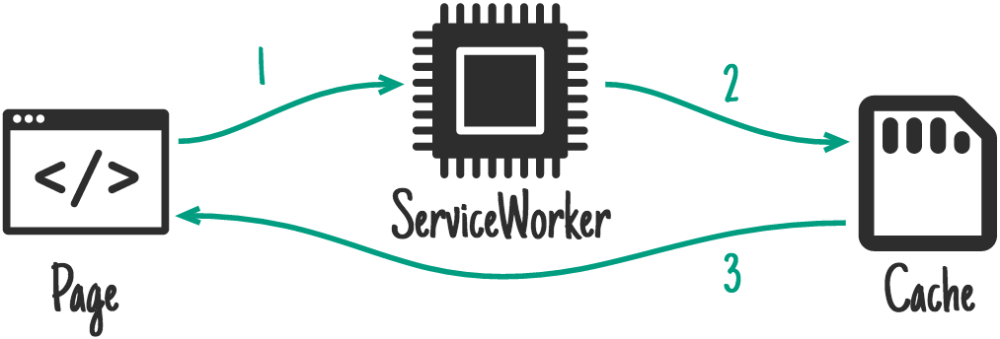

# 资源缓存

## 安装

**NPM**

```shell
npm i @glacierjs/plugin-assets-cache
```

**CDN**

```html
importScript("//xxx/glacierjs/plugin-assets-cache.min.js");
```

## 使用

```javascript
import { GlacierSW } from '@glacierjs/sw';
import { AssetsCacheSW, Strategy } from '@glacierjs/plugin-assets-cache';

const glacierSW = new GlacierSW();

glacierSW.use(new AssetsCacheSW({
    routes: [{
        // capture as string: store index.html with stale-while-revalidate strategy.
        capture: 'https://mysite.com/index.html',
        strategy: Strategy.STALE_WHILE_REVALIDATE,
    }, {
        // capture as RegExp: store all images with cache-first strategy
        capture: /\.(png|jpg)$/,
        strategy: Strategy.CACHE_FIRST
    }, {
        // capture as function: store all stylesheet with cache-first strategy
        capture: ({ request }) => request.destination === 'style',
        strategy: Strategy.CACHE_FIRST
    }],
}));
```
## 多种缓存策略

### stale-while-revalidate

stale-while-revalidate 模式允许您使用缓存（如果可用）尽快响应请求，如果没有缓存则回退到网络请求。    
然后使用网络请求来更新缓存。


```javascript
glacierSW.use(new AssetsCacheSW({
    routes: [{
        capture: xxx,
        strategy: Strategy.STALE_WHILE_REVALIDATE,
    }],
}));
```

### cache-first

离线 Web 应用程序将严重依赖缓存，但对于非关键且可以逐渐缓存的资源，**「缓存优先」**是最佳选择。    
如果缓存中有响应，则将使用缓存的响应来满足请求，并且根本不会使用网络。    
如果没有缓存响应，则请求将由网络请求完成，然后响应会被缓存，以便下次直接从缓存中提供下一个请求。


```javascript
glacierSW.use(new AssetsCacheSW({
    routes: [{
        capture: xxx,
        strategy: Strategy.CACHE_FIRST,
    }],
}));
```

### network-first

对于频繁更新的请求，**「网络优先」**策略是理想的解决方案。    
默认情况下，它会尝试从网络获取最新响应。如果请求成功，它会将响应放入缓存中。如果网络未能返回响应，则将使用缓存的响应。


```javascript
glacierSW.use(new AssetsCacheSW({
    routes: [{
        capture: xxx,
        strategy: Strategy.NETWORK_FIRST,
    }],
}));
```


### network-only

如果您需要从网络满足特定请求，network-only 模式会将资源请求进行透传到网络。


```javascript
glacierSW.use(new AssetsCacheSW({
    routes: [{
        capture: xxx,
        strategy: Strategy.NETWORK_ONLY,
    }],
}));
```
### cache-only

cache-only 策略确保从缓存中获取响应。这种场景不太常见，它一般匹配着「预缓存」策略会比较有用。



```javascript
glacierSW.use(new AssetsCacheSW({
    routes: [{
        capture: xxx,
        strategy: Strategy.CACHE_ONLY,
    }],
}));
```

## API

### registerRoute(route)

动态注册路由

```javascript
import { GlacierSW } from '@glacierjs/sw';
import { AssetsCacheSW, Strategy } from '@glacierjs/plugin-assets-cache';

const glacierSW = new GlacierSW();

const assetsCachePlugin = new AssetsCacheSW();

glacierSW.use(assetsCachePlugin);

// you can register route after plugin used.
assetsCachePlugin.registerRoute({
    capture: /\.(png|jpg)$/,
    strategy: Strategy.CACHE_FIRST
});
```

### updateRoute(routes)

刷新路由，它首先会清理当前路由，然后再注册新的路由。    
该接口尤其适合由外部配置来控制路由的场景。

```javascript
import { GlacierSW } from '@glacierjs/sw';
import { AssetsCacheSW, Strategy } from '@glacierjs/plugin-assets-cache';

const glacierSW = new GlacierSW();
const assetsCachePlugin = new AssetsCacheSW();

glacierSW.use(assetsCachePlugin);

assetsCachePlugin.registerRoute({
    capture: /\.(png|jpg)$/,
    strategy: Strategy.CACHE_FIRST
});

// will clean above route, and then register new routes.
assetsCachePlugin.updateRoute([{
    capture: 'https://mysite.com/index.html',
    strategy: Strategy.STALE_WHILE_REVALIDATE,
}, {
    capture: /\.(png|jpg)$/,
    strategy: Strategy.CACHE_FIRST
}, {
    capture: ({ request }) => request.destination === 'style',
    strategy: Strategy.CACHE_FIRST
}])
```


> 更多 API 参考 [api/modules/plugin_assets_cache](https://jerryc8080.github.io/GlacierJS/api/modules/plugin_assets_cache_src.html)

> 该插件由 [workbox-routing](https://developers.google.com/web/tools/workbox/modules/workbox-routing) 和 [workbox-strategy](https://developers.google.com/web/tools/workbox/modules/workbox-strategies#stale-while-revalidate) 提供底层支持