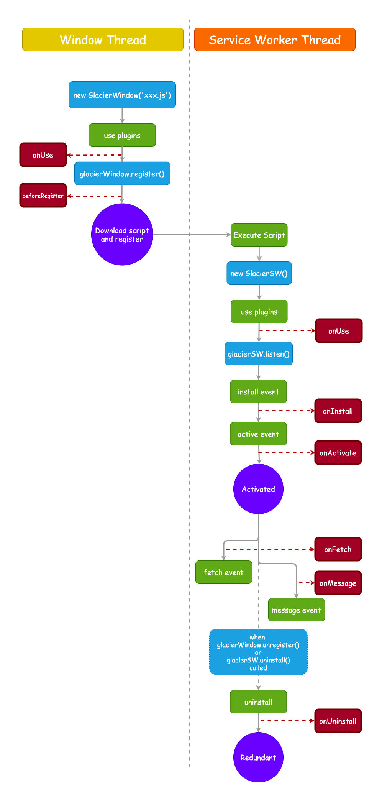

# 多维洋葱插件系统

## 概述

GlacierJS 针对传统的 ServiceWorker 生命周期钩子进行了封装，从而支持插件化。    
插件系统根据洋葱模型，为每一个原生的生命周期钩子都实现了一个「洋葱」，所以我们称这套系统为：    
> **「多维洋葱插件系统」**


基于洋葱模型，我们可以让事情更加聚焦，例如我们要对一个资源请求情况进行日志收集：

```javascript
class Log implements ServiceWorkerPlugin {

    // listen fetch event for all request
    public async onFetch(context: FetchContext, next) {
        const resourceUrl = context.res?.url;

        console.log(`Request a resource: ${resourceUrl}`)';
        try {
            // hand over the control to plugins behind.
            await next();
            // while behind plugins calling was all succeed.
            console.log(`request success: ${resourceUrl}`);
        } catch (err) {
            // while behind plugins calling has failed.
            console.error(`request failE: ${resourceUrl}`);
        }
    }
}
```

对传统生命周期进行封装之后，我们为每一个插件提供了更优雅的生命周期钩子函数



## 生命周期

### 主线程

```javascript
// code in window thread
import { WindowPlugin } from '@glacierjs/window';
import type { UseContext } from '@glacierjs/window';

export class MyPluginWindow implements WindowPlugin {
    constructor() {...}
    public onUse(context: UseContext) {...}
    public async beforeRegister() {...}
}
```

#### onUse: (context: UseContext) => void

* `context` [\<UseContext\>](https://jerryc8080.github.io/GlacierJS/api/modules/window_src.html#UseContext) 当前上下文，可以获取到 workbox 实例和当前 glacier 实例

当插件被使用的时候，该钩子会被触发：
```javascript
glacierWindow.use(new MyPlugin());
```

如果你的插件在后续的运行中需要用到 workbox 实例或者 glacier 实例，    
可以在此阶段把它们留在当前插件作用域中：
```javascript
public onUse(context: UseContext) {
    const { glacier, workbox } = context;
    this.glacier = glacier;
    this.workbox = workbox;
}
```

#### beforeRegister: (context: Object, next?: NextFn) => Promise\<void\>

* `context` 一个空对象，插件们可以以此作为通信手段。
* `next` [\<HookFn\>](https://jerryc8080.github.io/GlacierJS/api/modules/core_src.html#NextFn) 返回一个Promise，用以监听后面的插件的完成或者失败。

当即将要注册主线程时，该钩子会被触发。    
在此阶段你可以进行一些异步操作，例如我们通过远程配置来决定是否要卸载 ServiceWorker：
```javascript
public async beforeRegister(): Promise<void> {
    const config = await fetchRemoteConfig();

    // uninstall service worker while switch off
    if (config.switch === false) {
        // tell service worker thread to do some cleans job , and then uninstall it.
        this.glacier.unregister();

        // cut off behind plugins calling.
        throw ner Error('switch off service worker');
    }
}
```

### ServiceWorker 线程

```javascript
// code in service worker thread
import { ServiceWorkerPlugin } from '@glacierjs/sw';
import type { FetchContext, UseContext  } from '@glacierjs/sw';

export class MyPluginSW implements ServiceWorkerPlugin {
    constructor() {...}
    public async onUse(context: UseContext) {...}
    public async onInstall(context: InstallContext) {...}
    public async onActivate(context: ActivateContext) {...}
    public async onFetch(context: FetchContext) {...}
    public async onMessage(context: MessageContext) {...}
    public async onUninstall() {...}
}
```

#### onUse: (context: UseContext) => void

* `context` [\<UseContext\>](https://jerryc8080.github.io/GlacierJS/api/interfaces/sw_src.UseContext.html) 当前上下文，可以获取到当前 glacier 实例

当插件被使用的时候，该钩子会被触发：
```javascript
glacierSW.use(new MyPlugin());
```

它的用途与主线程 onUse 类似。


#### onInstall: (context: InstallContext, next?: NextFn) => Promise<void>

* `context` [\<InstallContext\>](https://jerryc8080.github.io/GlacierJS/api/interfaces/sw_src.InstallContext.html):
    * `event` [\<ExtendableEvent\>](https://developer.mozilla.org/en-US/docs/Web/API/ExtendableEvent) 传统的 [`install event`](https://developer.mozilla.org/en-US/docs/Web/API/ServiceWorkerGlobalScope/install_event) 事件的实例
* `next` [\<HookFn\>](https://jerryc8080.github.io/GlacierJS/api/modules/core_src.html#NextFn) 返回一个Promise，用以监听后面的插件的完成或者失败。

当 ServiceWorker `install` 事件被触发时，该钩子会被触发。

#### onActivate: (context: ActivateContext, next?: NextFn) => Promise<void>

* `context` [\<ActivateContext\>](https://jerryc8080.github.io/GlacierJS/api/interfaces/sw_src.ActivateContext.html):
    * `event` [\<ExtendableEvent\>](https://developer.mozilla.org/en-US/docs/Web/API/ExtendableEvent) 传统 [`activate event`](https://developer.mozilla.org/en-US/docs/Web/API/ServiceWorkerGlobalScope/activate_event) 的事件实例
* `next` [\<HookFn\>](https://jerryc8080.github.io/GlacierJS/api/modules/core_src.html#NextFn) 返回一个Promise，用以监听后面的插件的完成或者失败。

当 ServiceWorker `activate` 事件被触发时，该钩子会被触发。

#### onFetch: (context: FetchContext, next?: NextFn) => Promise<void>

* `context` [\<FetchContext\>](https://jerryc8080.github.io/GlacierJS/api/interfaces/sw_src.FetchContext.html):
    * `event` [\<FetchEvent\>](https://developer.mozilla.org/en-US/docs/Web/API/FetchEvent) 传统 `fetch` 事件的 `event` 实例
    * `res?` [\<Response\>] 一开始这个对象为空，插件可以复写这对象，如果所有插件都执行完，当前对象仍为空，glacier 会把该资源请求控制权交给浏览器。从而命中浏览器缓存或者网络资源。
* `next` [\<HookFn\>](https://jerryc8080.github.io/GlacierJS/api/modules/core_src.html#NextFn) 返回一个Promise，用以监听后面的插件的完成或者失败。

当 ServiceWorker [fetch](https://developer.mozilla.org/en-US/docs/Web/API/ServiceWorkerGlobalScope/onfetch) 事件被触发时，该钩子会被触发。

#### onMessage: (context: MessageContext, next?: NextFn) => Promise<void>

* `context` [\<MessageContext\>](https://jerryc8080.github.io/GlacierJS/api/interfaces/sw_src.MessageContext.html):
    * `event` [\<ExtendableMessageEvent\>](https://developer.mozilla.org/en-US/docs/Web/API/ExtendableMessageEvent) 传统 `fetch` 事件的 `event` 实例
* `next` [\<HookFn\>](https://jerryc8080.github.io/GlacierJS/api/modules/core_src.html#NextFn) 返回一个Promise，用以监听后面的插件的完成或者失败。

当 ServiceWorker [message](https://developer.mozilla.org/en-US/docs/Web/API/ServiceWorkerGlobalScope/onmessage) 事件被触发时，该钩子会被触发。


#### onUninstall: (context: Object, next?: NextFn) => Promise<void>

* `context` 一个空对象，插件们可以以此作为通信手段。
* `next` [\<HookFn\>](https://jerryc8080.github.io/GlacierJS/api/modules/core_src.html#NextFn) 返回一个Promise，用以监听后面的插件的完成或者失败。